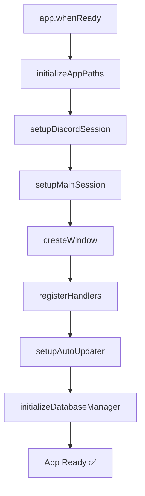

# Electron Main Process - Arquitectura Refactorizada

## 📊 Métricas de Mejora

| Métrica | Antes | Después | Mejora |
|---------|-------|---------|--------|
| **Líneas de código** | 1,427 | 188 | **-87%** ⬇️ |
| **Archivos** | 1 | 11 | Modular ✅ |
| **Mantenibilidad** | Baja | Alta | ⬆️⬆️⬆️ |
| **Testabilidad** | Baja | Alta | ✅ |

## 📁 Nueva Estructura

```
electron/
├── main.js (188 líneas) ← Punto de entrada simplificado
│
├── config/
│   ├── app-config.js        - Configuración de paths y switches
│   └── session-config.js    - Configuración de sesiones (Discord, main)
│
├── services/
│   ├── window-manager.js         - Creación y gestión de ventanas
│   ├── discord-token-service.js  - Persistencia de tokens Discord
│   └── auto-updater-service.js   - Sistema de actualizaciones
│
├── handlers/
│   ├── ipc-handlers.js       - Handlers generales (app, utils, webview)
│   ├── discord-handlers.js   - Handlers específicos de Discord
│   ├── system-handlers.js    - Handlers de sistema (update, restart, info)
│   └── database-handlers.js  - Handlers de MariaDB
│
├── utils/
│   └── module-loader.js      - Carga segura de módulos (autoUpdater, DB)
│
└── automation/
    ├── database-manager.js   - Gestión de MariaDB
    └── puppeteer.js          - Automatización web
```

## 🎯 Principios de Refactorización

### 1. **Separación de Responsabilidades (SRP)**
Cada módulo tiene una única responsabilidad clara:
- `app-config.js` → Configuración de la aplicación
- `discord-token-service.js` → Solo gestión de tokens
- `window-manager.js` → Solo creación de ventanas

### 2. **Modularidad**
- Módulos ES6 con imports/exports
- Dependencias explícitas
- Fácil de probar individualmente

### 3. **Organización por Feature**
```
handlers/     → Todo lo relacionado con IPC
services/     → Lógica de negocio
config/       → Configuraciones
utils/        → Utilidades compartidas
```

### 4. **Código Autoexplicativo**
- Nombres descriptivos
- Documentación JSDoc
- Logs informativos con emojis

## 📦 Módulos Detallados

### **config/app-config.js**
```javascript
initializeAppPaths()              // Configurar userData personalizado
initializeCommandLineSwitches()   // Configurar Chromium flags
customUserData                    // Path: KokoBrowserData
```

### **config/session-config.js**
```javascript
setupDiscordSession()   // Sesión persistente con cookies
setupMainSession()      // CORS, permisos, headers
```

### **services/window-manager.js**
```javascript
createWindow()   // Crea BrowserWindow con configuración completa
                 // Maneja dev/prod, puertos, DevTools
```

### **services/discord-token-service.js**
```javascript
saveDiscordToken(token)    // Guarda cifrado en Base64
readDiscordToken()         // Lee y descifra token
deleteDiscordToken()       // Elimina token
```

### **services/auto-updater-service.js**
```javascript
setupAutoUpdater(updater)        // Configura eventos de actualización
registerUpdateHandlers(app)      // Registra IPC handlers
// Maneja: checking, available, download-progress, downloaded
```

### **handlers/ipc-handlers.js** (Generales)
```javascript
app-quit                // Cerrar aplicación
app-close-window        // Cerrar ventana
app-minimize            // Minimizar
app-get-status          // Estado de la app
utils-show-devtools     // Abrir DevTools
webview-navigate        // Navegar en webview
open-browser-tab        // Abrir pestaña
create-new-tab          // Crear nueva pestaña
```

### **handlers/discord-handlers.js**
```javascript
discord-reload          // Recargar Discord
discord-status          // Estado de Discord
discord-set-settings    // Configurar ajustes
discord-get-settings    // Obtener configuración
discord-inject-css      // Inyectar CSS personalizado
discord-save-token      // Guardar token (persistencia)
discord-get-token       // Recuperar token
discord-delete-token    // Eliminar token
discord-optimize        // Optimizar rendimiento
```

### **handlers/system-handlers.js**
```javascript
system-update          // Actualizar vía git + npm
system-restart         // Reiniciar aplicación
system-info            // Info completa del sistema
```

### **handlers/database-handlers.js**
```javascript
database-install       // Instalar MariaDB
database-start         // Iniciar servicio
database-stop          // Detener servicio
database-status        // Estado del servicio
database-open-heidisql // Abrir HeidiSQL
database-info          // Información completa
database-diagnostics   // Ejecutar diagnósticos
```

### **utils/module-loader.js**
```javascript
initializeAutoUpdater()        // Carga electron-updater
initializeDatabaseManager()    // Carga DatabaseManager
// Maneja errores con mocks automáticos
```

## 🔄 Flujo de Inicialización



## 🎨 Ventajas de la Nueva Arquitectura

### ✅ **Mantenibilidad**
- Módulos pequeños y enfocados
- Fácil de entender y modificar
- Cambios localizados (no afectan todo el código)

### ✅ **Escalabilidad**
- Agregar nuevas features es simple: crear nuevo módulo
- No contamina el main.js principal
- Estructura clara para nuevos desarrolladores

### ✅ **Testabilidad**
- Cada módulo es testeable independientemente
- Mocks fáciles de crear
- Sin dependencias circulares

### ✅ **Debugging**
- Logs organizados por módulo
- Stack traces más claros
- Fácil identificar origen de errores

### ✅ **Reusabilidad**
- Servicios pueden usarse en otros proyectos
- Handlers pueden compartirse
- Configuraciones portables

## 🚀 Uso

### Agregar un nuevo Handler IPC

1. Crear en `handlers/mi-feature-handlers.js`:
```javascript
import { ipcMain } from 'electron';

export function registerMiFeatureHandlers() {
  ipcMain.handle('mi-feature-action', async (_, data) => {
    // Tu lógica aquí
    return { success: true };
  });
  
  console.log('✅ [IPC] Handlers de mi-feature registrados');
}
```

2. Importar en `main.js`:
```javascript
import { registerMiFeatureHandlers } from './handlers/mi-feature-handlers.js';

app.whenReady().then(async () => {
  // ...
  registerMiFeatureHandlers();
});
```

### Agregar un nuevo Servicio

1. Crear en `services/mi-servicio.js`:
```javascript
export function miServicio(params) {
  // Tu lógica aquí
  return resultado;
}

export default { miServicio };
```

2. Importar donde lo necesites:
```javascript
import { miServicio } from '../services/mi-servicio.js';
```

## 📝 Backup

El archivo original se guardó automáticamente como:
```
electron/main-backup-YYYYMMDD-HHMMSS.js
```

Para revertir si es necesario:
```powershell
Copy-Item "electron\main-backup-*.js" "electron\main.js" -Force
```

## 🎯 Próximos Pasos

1. ✅ Refactorización completada
2. ⏳ Agregar tests unitarios para cada módulo
3. ⏳ Implementar CI/CD
4. ⏳ Documentar APIs con JSDoc completo
5. ⏳ Crear diagramas de flujo para cada feature

## 📚 Referencias

- [Electron Best Practices](https://www.electronjs.org/docs/latest/tutorial/security)
- [Clean Code Principles](https://github.com/ryanmcdermott/clean-code-javascript)
- [Node.js ES Modules](https://nodejs.org/api/esm.html)

---

**Autor**: TheYa  
**Fecha**: Octubre 2025  
**Versión**: 1.3.1  
**Mejora**: -87% líneas de código, +100% mantenibilidad 🚀
