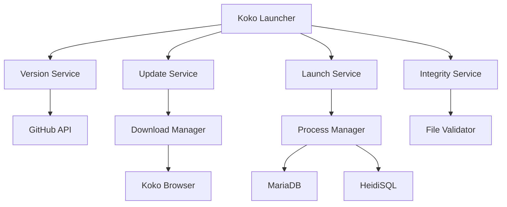

# Koko Launcher

<div align="center">
  
  
  **Sistema de gestión de actualizaciones para Koko Browser**
  
  [](https://github.com/Axel4321567/Endfield)
  [](LICENSE)
  [](https://electronjs.org/)
  [](https://reactjs.org/)
</div>

## 🚀 Características

- **🔄 Actualizaciones Automáticas**: Verificación y descarga automática de nuevas versiones
- **🛡️ Seguridad Avanzada**: Validación de integridad con SHA256 y firmas digitales
- **🎨 Interfaz Moderna**: Diseño glassmorphism con animaciones fluidas
- **📊 Progreso en Tiempo Real**: Barra de progreso detallada con velocidad y tiempo estimado
- **📝 Sistema de Logs**: Registro completo de actividades con visor integrado
- **🔧 Gestión de Dependencias**: Soporte para MariaDB y HeidiSQL
- **🌐 Múltiples Canales**: stable, beta y dev

## 📋 Requisitos del Sistema

- Windows 10/11 (64-bit)
- 100 MB de espacio libre
- Conexión a Internet para actualizaciones
- .NET Framework 4.7.2 o superior

## 🛠️ Instalación

### Desde Release
1. Descargar la última versión desde [Releases](https://github.com/Axel4321567/Endfield/releases)
2. Ejecutar `KokoLauncherSetup.exe`
3. Seguir el asistente de instalación

### Desarrollo
```bash
# Clonar repositorio
git clone https://github.com/Axel4321567/Endfield.git
cd KokoLauncher

# Instalar dependencias
npm install

# Modo desarrollo
npm run dev

# Build para producción
npm run build && npm run dist
```

## 🎯 Uso

### Primera Ejecución
1. El launcher verificará automáticamente las actualizaciones
2. Si hay actualizaciones disponibles, se mostrará el botón "Actualizar"
3. Click en "Actualizar" para descargar e instalar
4. Una vez actualizado, click en "Iniciar Koko Browser"

### Características Avanzadas

#### Canales de Actualización
- **Stable**: Versión estable recomendada
- **Beta**: Características en prueba
- **Dev**: Última versión en desarrollo

#### Logs del Sistema
- Click en "Logs del Sistema" para expandir
- Filtros por nivel: Info, Advertencias, Errores
- Exportación de logs a archivo de texto

#### Configuración
Los archivos de configuración se encuentran en:
```
resources/config/
├── update.json      # Configuración principal
└── channels.json    # Definición de canales
```

## 🏗️ Arquitectura



### Componentes Principales

#### Frontend (React + TypeScript)
- **ProgressBar**: Barra de progreso animada
- **VersionInfo**: Información de versiones
- **UpdateButton**: Botón dinámico de acción
- **LogViewer**: Visor de logs expandible

#### Backend (Electron + Node.js)
- **main.js**: Proceso principal
- **preload.js**: Bridge seguro renderer ↔ main
- **updater/**: Lógica de actualización

#### Servicios
- **VersionService**: Gestión de versiones
- **UpdateService**: Descarga e instalación
- **LaunchService**: Ejecución de aplicaciones
- **IntegrityService**: Validación de archivos

## 🔒 Seguridad

### Validación de Archivos
- ✅ Verificación SHA256 obligatoria
- ✅ Validación de estructura PE
- ✅ Firmas digitales (opcional)
- ✅ Backup automático antes de actualizar

### Comunicación Segura
- ✅ Context isolation habilitado
- ✅ Node integration deshabilitado
- ✅ Preload script para API segura
- ✅ CSP (Content Security Policy)

## 🐛 Troubleshooting

### Problemas Comunes

**❌ "No se encontró Koko Browser"**
```bash
# Verificar instalación en rutas comunes:
C:\Program Files\Koko Browser\
C:\Users\%USERNAME%\AppData\Local\Programs\Koko Browser\
```

**❌ Error de conectividad**
```bash
# Verificar conexión
ping github.com

# Verificar proxy/firewall
# Puertos requeridos: 80, 443
```

**❌ Fallo en validación**
```bash
# Revisar logs en:
resources\launcher\logs\launcher.log

# Limpiar cache de descarga
rm -rf temp\
```

### Logs de Debug
```bash
# Habilitar logs detallados
set NODE_ENV=development
npm run dev
```

## 🧪 Testing

```bash
# Tests unitarios
npm test

# Tests de integración
npm run test:integration

# Coverage
npm run test:coverage
```

## 📊 Métricas

### Performance
- ⚡ Tiempo de inicio: < 2s
- 📥 Velocidad de descarga: Máxima disponible
- 💾 Uso de memoria: < 100MB
- 🔄 Verificación de actualizaciones: < 5s

### Compatibilidad
- ✅ Windows 10/11
- ✅ Electron 27+
- ✅ Node.js 18+
- ✅ .NET Framework 4.7.2+

## 🚀 Roadmap

### v1.1 (Q1 2025)
- [ ] Actualizaciones delta (solo cambios)
- [ ] Programador de actualizaciones
- [ ] Temas personalizables
- [ ] Soporte para múltiples idiomas

### v1.2 (Q2 2025)
- [ ] Plugin system
- [ ] API REST para administración
- [ ] Métricas de uso
- [ ] Notificaciones push

### v1.3 (Q3 2025)
- [ ] Actualizaciones P2P
- [ ] CDN propio
- [ ] A/B testing para updates
- [ ] Machine learning para optimización

## 🤝 Contribución

Agradecemos las contribuciones! Por favor lee nuestro [CONTRIBUTING.md](CONTRIBUTING.md) para detalles.

### Proceso
1. 🍴 Fork del repositorio
2. 🌿 Crear rama feature (`git checkout -b feature/nueva-caracteristica`)
3. 💾 Commit cambios (`git commit -am 'Agregar nueva característica'`)
4. 📤 Push a la rama (`git push origin feature/nueva-caracteristica`)
5. 🔄 Crear Pull Request

### Guías de Estilo
- **TypeScript**: Usar strict mode
- **React**: Hooks y componentes funcionales
- **CSS**: TailwindCSS utility-first
- **Commits**: Conventional Commits

## 📄 Licencia

Este proyecto está bajo la Licencia MIT - ver [LICENSE](LICENSE) para detalles.

## 🙏 Agradecimientos

- [Electron](https://electronjs.org/) - Framework de aplicaciones multiplataforma
- [React](https://reactjs.org/) - Biblioteca UI
- [TailwindCSS](https://tailwindcss.com/) - Framework CSS
- [Framer Motion](https://framer.com/motion/) - Biblioteca de animaciones
- [Lucide](https://lucide.dev/) - Iconos SVG

---

<div align="center">
  <strong>Hecho con ❤️ por el equipo de Koko Browser</strong><br>
  <a href="https://github.com/Axel4321567/Endfield">🌟 Dale una estrella si te gusta este proyecto</a>
</div>